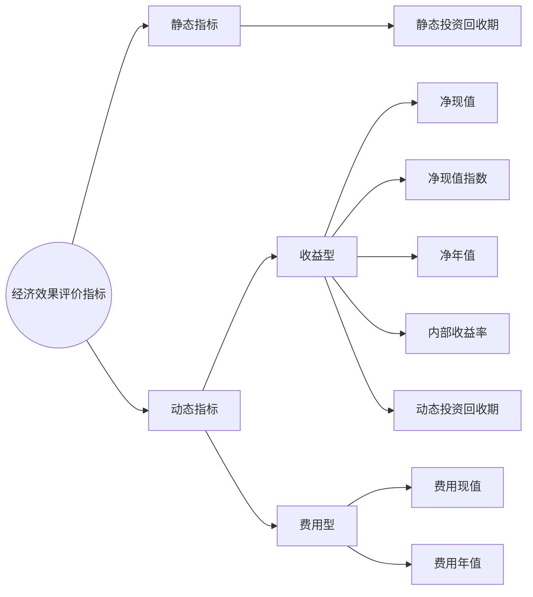

---
{"dg-publish":true,"dg-path":"技术经济与工程管理/经济效果评价指标.md","permalink":"/技术经济与工程管理/经济效果评价指标/","dgPassFrontmatter":true,"noteIcon":"","created":"2024-04-16T13:01:27.455+08:00","updated":"2024-04-28T12:57:40.802+08:00"}
---

## 静态指标
***静态投资回收期***  
Payback period
项目各年的**净收入**将全部**投资**收回所需的期限
$$\begin{align}
 & \sum\limits_{t=0}^{T_{P}}(CI-CO)_{t}=0 \\
 & T_{P}=(T-1)+ \dfrac{|\sum\limits_{t=0}^{T-1}(CI-CO)_{t}|}{(CI-CO)_{T}}
\end{align}$$
-  $T_{P}$ 投资回收期
-  $T$ 为项目累积净现金流量首次为非负值的年份
-  $CI$ 现金流入量
-  $CO$ 现金流出量
-  $(CI-CO)_{t}$  第 t 年的净现金流量

***总投资收益 ROI***  
Return on investment
正常年份的**息税前利润**与**投资总额**的比值
$ROI= \dfrac{息税前利润}{总投资}$
投资所创造的收益额
***资本金净利润  ROE***  
Return on Equity
正常年份的**年净利润**与**项目资本金**的比值
$ROI= \dfrac{净利润}{资本金}$
单位资本金所创造的收益额
## 动态指标
**考虑资金时间价值**   
### 收益型
***净现值 NPV***  
Net Present Value 
按一定的**折现率**，
将各年的**净现金流量**折现到**期初**的现值之和
	考察资金利用的**效果**
	**总投资**所能带来的净现值
$$\begin{align}
NPV\geq 0\quad 予以接受 \\
NPV<0\quad 予以拒绝
\end{align}$$

***基准折现率***  $i_{0}$
投资者要求的**最低投资收益率**
	[[基准折现率\|基准折现率]]越高，方案越可能被拒绝
**折现时，使用的收益率**

***净现值指数 NPVI***  
项目**净现值**与项目**投资的现值**之比
	考察资金利用的**效率**
	**单位投资**所能带来的净现值
$$\begin{align}
NPVI\geq 0\quad 予以接受 \\
NPVI<0\quad 予以拒绝
\end{align}$$
>[!tip] 
**净现值最大准则**：NPV 越大的方案相对越优

**项目投资现值**   $K_{p}$ 
将所有投资折现到期初

**净收入现值**  $NB_{p}$
可看作项目投资现值的函数 $NB_{p}=f(K_{p})$
[[规模经济原理\|规模经济原理]]
**各年净收入**  $NB_{t}$ 
$$\begin{align} 
NPV&=\sum\limits_{t=0}^{n} (CI-CO)_{t}(1+i_{0})^{-t} \\
&=NB_{p}-K_{p} \\
NPVI&= \dfrac{NPV}{K_{p}} \\
K_{p}&=\sum\limits_{t=0}^{n} K_{t}(1+i_{0}^{-t})\\
NB_{p}&=\sum\limits_{t=1}^{n} NB_{t}(1+i_{0})^{-t} \\

\end{align}$$

***净年值  NAV***  
**项目寿命期**内每年的等额的超额收益

$NAV=NPV(A/ P,i,n)$
将**净现值**按照一定的折现率**分摊到项目寿命中的每一年**
$$\begin{align}
NAV\geq 0\quad 予以接受 \\
NAV<0\quad 予以拒绝
\end{align}$$
### 费用型
不看收益，比较花费的多少
费用现值或费用年值最**小**的为**优**

***费用现值 PC***  
$PC=\sum\limits_{t=0}^{n}CO_{t}(P / F,i_{0},n)$
将花费**折现**到初年作为现值，进行比较
***费用年值 AC***  
$AC=PC(A / P,i_{0},n)$
将费用现值**摊销**到所有年限

>[!tip]- 例子
>选购哪台设备?
>
>**计算 AC PC**
>对 A 设备
>PC=10+5 (P/A, 15%, 3)+6 (P/A, 15%, 3)(P/F, 15%, 3)-4 (P/F, 15%, 6)
>AC=PC (A/P, 15%, 6)
>>[!tip] 注意
>>求 AC 是已知现值 (PC), 求年金
>>用 AC=PC (A/P, i, n)
>>还要注意计算 PC 时, 残值是资金的回收, 要作为减项减去
>>始终注意 **资金的时间价值**

### 内部收益的试插法
***内部收益报酬率***  $IRR$ 
Internal Rate of Return 
**净现值为零的折现率**
1. 即在项目寿命期内，项目始终处于“偿付”未被收回的投资的状况
2. 项目寿命期内没有回收投资的盈利率
$\sum\limits_{t=0}^{n}(CI-CO)_{t}(1+IRR )^{-t}=0$

**折现率临界值**  $i_{*}$    此时 NPV=0
$$\begin{align}
i<i^{*}\quad NPV>0 \\
i=i^{*}\quad NPV=0 \\
i>i^{*}\quad NPV<0
\end{align}$$

>[!tip] 
>注意找距离最近的一正一负的两个NPV

$$\begin{align}
 & i_{1}\quad NPV_{1}>0 \\
 & i_{2}\quad NPV_{2}<0 \\ 
 & IRR \approx i_{*}= i_{1}+ \dfrac{NPV_{1}}{NPV_{1}+|NPV_{2}|}\times(i_{2}-i_{1})
\end{align}$$
与**基准折现率**$i_{0}$ 比较，
如果 $i_{0}$ 比 IRR 小，则可以盈利:
$$\begin{align}
IRR \geq i_{0}\quad 项目可以接受 \\
IRR < i_{0}\quad 项目应该拒绝
\end{align}$$

$$\begin{align}  
 & \sum\limits_{t=0}^{n}(CI-CO)_{t}(1+IRR )^{-t}=0 \\
 & (CI_{t}-CO_{t})=a_{t} \\ 
 & \dfrac{1}{(1+IRR)^{t}}=x^{t} \\  & a_{0}+a_{1}x+a_{2}x^{2}+\cdots+a_{n}x^{n}=0 \\
\end{align}$$

对非常规项目:
$IRR$ 可能存在多个解, 如果有多个解, 则所有的解**都不是真正**的 $IRR$

***动态投资回收期***  $T_{p}^{*}$
项目**累积净现金流量现值为零**所需要的时间
$$\begin{align}
\sum\limits_{t=0}^{T_{p}^{*}}(CI-CO)_{t}(1+i_{o})^{-t}=0
\end{align}$$
计算各年净现金、累积净现值

计算净现金流量
根据净现金流量折现到期初，得到净现金流量现值
再计算累积现值

比**静态投资回收期**要长
考虑时间价值，损失

**基准动态回收期** $T_{b}^{*}$
$$\begin{align}
T_{P}^{*}\leq T_{b}^{*}\quad 项目可以接受 \\
T_{P}^{*}> T_{b}^{*}\quad 项目应该拒绝
\end{align}$$
