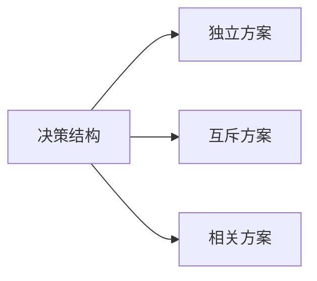

---
{"dg-publish":true,"dg-path":"技术经济与工程管理/经济效果评价方法.md","permalink":"/技术经济与工程管理/经济效果评价方法/","dgPassFrontmatter":true,"noteIcon":"","created":"2024-04-16T13:01:27.456+08:00","updated":"2024-04-26T23:22:56.217+08:00"}
---

[[经济效果评价指标\|经济效果评价指标]]

# 独立方案
作为评价对象的各个方案的现金流是独立的，不具有相关性，且任一方案的采用与否都不影响其他方案是否采用的决策。
***绝对经济效果检验***
独立方案采用与否，只取决于方案自身的经济性
	只需检验各个方案能否通过**NPV、 NAV、IRR**等指标的评价标准 (无论采用哪种评价指标，评价结论都是相同的)
# 互斥方案
方案之间:互不相容，互相排斥
多个至多只能选其中之一
先进行**绝对经济效果检验**
	看自身条件是否满足
再进行**相对经济效果检验**
	比较选优

***相对经济效果检验***
按一定的标准，比较哪个方案相对最优
>[!tip] 
**必须先经过绝对检验，再进行相对检验**
## 寿命期相等
NPV **更大**， **且非负**, 为较优方案
### 收益型
#### 增量/差额分析法
对于**投资较大**的方案，其现金流量可以划分为两部分
1. 第一部分与投资较小的方案的现金流量完全相同
2. 第二部分则是增量投资的收益
判断第二部分多**投入的资金能否带来满意的增量收益**

***增量净现金流***  $\Delta NCF$   
各年净现金流量之差
***增量净现值***   $\Delta NPV$   
将各年净现金流量之差折现为**净现值**

>[!important] 总体结论
>实际上：差额投资分析还是建立在单独的两个项目的绝对经济检验之上
>1. 如果只要求比较哪个项目更优
>	**净现值 (NPV) 最大**且**非负**的方案为最优方案
>2. 如果明确要求使用 $\Delta IRR$
>	可以先分别求两个项目的**净现金流量现值**（顺便进行绝对经济检验），再做差求出 **增量净现金流量现值**，再求和为 **增量净现值**，根据内部投资收益率的试插法计算出 $\Delta IR R$
>
#### 差额投资内部收益率
***增量内部收益率***  $\Delta IRR$  
$$\begin{align}
\sum\limits_{t=0}^{n}(\Delta CI-\Delta CO)_{t}(1+\Delta IRR)^{-t}=0 \\
\Delta CI=CI_{A}-CI_{B}\quad \Delta CO=CO_{A}-CO_{B}
\end{align}$$
为 $NPV_{A}=NPV_{B}$ 时的折现率
$\Delta IRR>i_{0}$
**则差额投资收益满意**，选**投资大的方案**
反之选投资小的方案

>[!tip] 
>ΔIRR只能反映增量现金流的经济型（相对效 果），不能反映各方案自身的经济性（绝对 经济效果）
>只能进行方案间比较，不能判断方案的取舍

### 费用型
**PC AC** 
**仅需进行相对经济效果检验**
**费用现值、费用年值最小的方案为最优方案**
## 寿命期不等
### 收益型
净年值法 NAV
**净年值最大且非负的方案为最优方案**
### 费用型
AC 
仅需进行相对经济效果检验
**费用年值最小的方案为最优方案**
# 相关方案
### 现金流相关型
任一方案的取舍会导致其他方案现金 流的变化
#### 互斥方案组合法
1. 列出全部互斥组合方案 
$m$ 个独立方案， $2^{m}-1$ 个方案组合数
2. 再按互斥方案的评选方法进行评价选择

### 资金约束相关
资本限量(Capital Rationing) 企业对投资总额有限制，一些NPV＞0的项目不能实施。

在资金有限的情况下，接收某些方案则意味着不得不放弃另外一些方案

#### 互斥方案组合法 (推荐使用)
列出所有可能的方案组合，计算各方按组合的 **总投资**和**净现值**，选择在一定投资限额内，**净现值最大**的方案组合

1. 列出全部互斥组合方案 
$m$ 个独立方案， $2^{m}-1$ 个方案组合数
2. 将所有互斥组合方案按投资额大小顺序排列
除去不满足约束条件的方案组合
3. 再按互斥方案的评选方法进行评价选择

#### 净现值+剩余资金法
净现值指数排序法可能无法选择到最佳方案组合

计算每个项目的 NPV，淘汰 NPV<0 的项目
NPV 从大到小顺序排列，将对应投资额与可利用资金进行比较
投资额小于可利用资金时采纳项目，并将投资额与可利用资金做差，可利用剩余投资额作为下一个项目的可利用资金
依次进行下去
