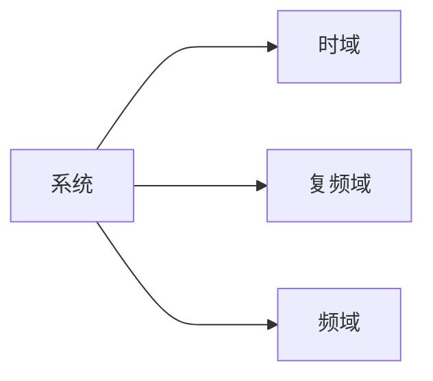

---
{"dg-publish":true,"dg-pinned":true,"dg-path":"自动控制原理/自动控制原理. md","permalink":"/自动控制原理/自动控制原理/","pinned":true,"dgPassFrontmatter":true,"noteIcon":"","created":"2024-04-16T13:01:27.306+08:00","updated":"2024-05-01T22:57:11.874+08:00"}
---

#自动化
[[自动控制原理出现的问题\|自动控制原理出现的问题]]
[[自动控制原理要掌握的基本能力\|自动控制原理要掌握的基本能力]]
### 经典控制理论
[[自动控制的一般概念\|自动控制的一般概念]]
[[自动控制系统\|自动控制系统]]
[[控制系统数学模型\|控制系统数学模型]]
[[线性系统时域分析\|线性系统时域分析]]
[[根轨迹法\|根轨迹法]]
[[频域分析法\|频域分析法]]

[[校正环节的设计\|校正环节的设计]]
### 现代控制理论
[[状态空间\|状态空间]]

### 相关数学基础 ：
[[拉普拉斯变换\|拉普拉斯变换]]
[[微分方程\|微分方程]]
[[传递函数\|传递函数]]

### 参考资料
胡寿松，姜斌，张绍杰. *自动控制原理（第八版）*. 科学出版社