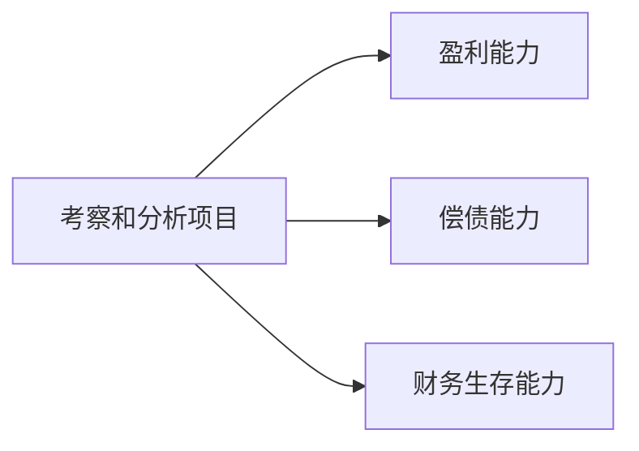

---
{"dg-publish":true,"dg-path":"技术经济与工程管理/财务评价.md","permalink":"/技术经济与工程管理/财务评价/","dgPassFrontmatter":true,"noteIcon":"","created":"2024-04-16T13:01:27.475+08:00","updated":"2024-04-25T15:22:06.777+08:00"}
---

### 指标体系

<a class="markdown-embed-link" href="//#791eee" aria-label="Open link"><svg xmlns="http://www.w3.org/2000/svg" width="24" height="24" viewBox="0 0 24 24" fill="none" stroke="currentColor" stroke-width="2" stroke-linecap="round" stroke-linejoin="round" class="svg-icon lucide-link"><path d="M10 13a5 5 0 0 0 7.54.54l3-3a5 5 0 0 0-7.07-7.07l-1.72 1.71"></path><path d="M14 11a5 5 0 0 0-7.54-.54l-3 3a5 5 0 0 0 7.07 7.07l1.71-1.71"></path></svg></a>

### 财务报表
[[现金流量表\|现金流量表]]
[[利润与利润分配表\|利润与利润分配表]]
[[财务计划现金流量表\|财务计划现金流量表]]
[[资产负债表\|资产负债表]]
[[借款还本付息计划表\|借款还本付息计划表]]

## 投资估算
### 建设投资的估算
项目规划和建议书阶段，投资估算要求精度低，可利用简单估算法。
#### 简单估算法
#### 概算法

### 流动资金的估算
#### 扩大指标估算

#### 分项详细估算

### 建设期利息的估算

### 财务评价和国民经济评价
财务角度 $\leftrightarrow$   国家整体 (社会) 的角度
实际收支 $\leftrightarrow$ 所耗费全社会有用资源, 对全社会提供有用产品
现行市场价格 $\leftrightarrow$ 机会成本和供求关系
基准收益率 $\leftrightarrow$ 社会折现率

