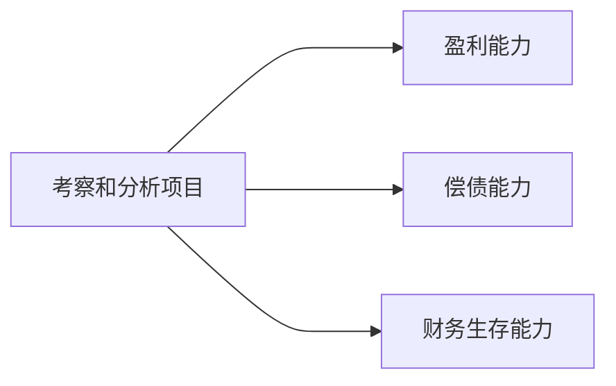

---
{"dg-publish":true,"dg-path":"技术经济与工程管理/财务评价.md","permalink":"/技术经济与工程管理/财务评价/","dgPassFrontmatter":true,"noteIcon":"","created":"2024-05-21T15:20:28.702+08:00","updated":"2024-05-30T17:32:41.644+08:00"}
---

### 指标体系

<a class="markdown-embed-link" href="//#eeba89" aria-label="Open link"><svg xmlns="http://www.w3.org/2000/svg" width="24" height="24" viewBox="0 0 24 24" fill="none" stroke="currentColor" stroke-width="2" stroke-linecap="round" stroke-linejoin="round" class="svg-icon lucide-link"><path d="M10 13a5 5 0 0 0 7.54.54l3-3a5 5 0 0 0-7.07-7.07l-1.72 1.71"></path><path d="M14 11a5 5 0 0 0-7.54-.54l-3 3a5 5 0 0 0 7.07 7.07l1.71-1.71"></path></svg></a>

(terminology::**Economics and Engineering Management**)

技术科学与经济科学交叉的边缘科学
- 宏观目标：资源达到最有效利用
- 微观目标：投资是否具有可行性

技术与经济的关系：
相互**依赖/发展/制约**
### 概述
*项目 Project*
国际项目管理协会（IPMA）：项目是受时间和成本**约束**的、用以实现一系列既定的可交付物（达到项目目标的范围）、同时满足质量标准和需求的**一次性**活动。
*项目可行性研究*
Feasibility Study
项目可行性研究是对项目在投资决策前进行技术经济论证的一门综合性技术。

它的任务是**以市场为前提，以技术为手段，以经济效益为最终目标**，对拟建的项目从必要性、可能性、有效性和合理性等方面进行全面、系统地论证，做出项目可行或不可行的评价。

可行性研究是投资决策的核心环节

*财务评价*
[[财务评价\|财务评价]]
根据国家现行的财税制度和价格体系，在财务效益与费用的估算以及编制财务辅助报表的基础上，编制财务报表，计算财务分析指标，

>考察和分析项目的**盈利能力**、**偿债能力**和**财务生存能力**

判断项目的财务可行性，明确项目对财务主体的价值以及对投资者的贡献，为投资决策、融资决策以及银行贷款等提供依据。

### 章节
[[现金流量\|现金流量]]
[[资金的等值计算\|资金的等值计算]]
[[经济效果评价指标\|经济效果评价指标]]
[[经济效果评价方法\|经济效果评价方法]]
[[不确定性分析和风险分析\|不确定性分析和风险分析]]
[[财务评价\|财务评价]] 

[[复利\|复利]]
[[技术经济上机\|技术经济上机]]
[[技术经济出现的问题\|技术经济出现的问题]]

#### 盈利能力
[[经济效果评价指标\|经济效果评价指标]]

#### 偿债能力
**利息备付率** =息税前利润/当期应付利息×100%

**偿债备付率**=可用于还本付息的资金/当期应还本付息的金额×100%

**资产负债率** =期末负债总额/期末资产总额×100%
#### 财务生存能力分析
财务生存能力分析也称为资金平衡分析 

拥有足够的经营净现金流量是财务可持续性的基本条件，特别是在运营初期。 

各年累计盈余资金不出现负值是财务生存的必要条件。

### 财务报表
[[现金流量表\|现金流量表]]
[[利润与利润分配表\|利润与利润分配表]]
[[财务计划现金流量表\|财务计划现金流量表]]
[[资产负债表\|资产负债表]]
[[借款还本付息计划表\|借款还本付息计划表]]

### 财务评价和国民经济评价
**评价角度：**
财务角度 $\leftrightarrow$   国家整体 (社会) 的角度

**费用效益的划分：**
实际收支 $\leftrightarrow$ 所耗费全社会有用资源, 对全社会提供有用产品

**采用的价格：**
现行市场价格 $\leftrightarrow$ 机会成本和供求关系

**折现率：**
基准收益率 $\leftrightarrow$ 社会折现率

## 投资估算
### 建设投资的估算
项目规划和建议书阶段，投资估算要求精度低，可利用简单估算法。
#### 简单估算法
#### 概算法

### 流动资金的估算
#### 扩大指标估算

#### 分项详细估算

### 建设期利息的估算

