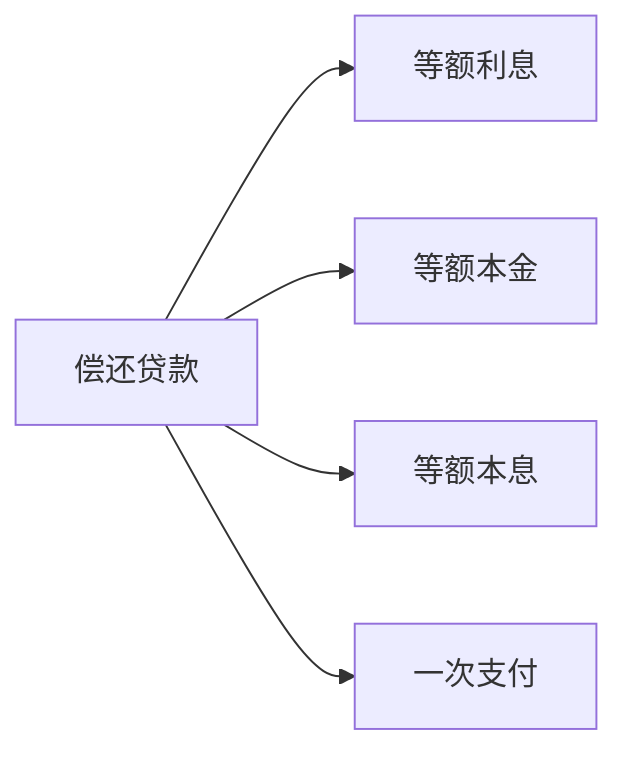

---
{"dg-publish":true,"dg-path":"技术经济与工程管理/资金的等值计算.md","permalink":"/技术经济与工程管理/资金的等值计算/","dgPassFrontmatter":true,"noteIcon":"","created":"2024-04-16T13:01:27.476+08:00","updated":"2024-04-25T13:51:08.804+08:00"}
---

## 资金的时间价值
**不同时间**发生的等额资金在价值上的差别称为资金的**时间价值**
也即资金在生产和流通过程中随着时间推移而产生的增值

***时间价值的表现形式：***
- **利润/收益    Income/profit**
	资金投入生产或流通领域产生的增值
- **利息   Interset**
	资金存入银行或向银行贷款所得到或付出的增值额

***时间价值的衡量尺度：***
- 绝对尺度：利息或收益
- 相对尺度：利息率或收益率

- **利息**
	贷款人向借款人让渡资金使用权而得到的一种报酬
- **利率**
	一个计息周期内，利息总额与本金的比率
### 单利
以借款**本金**为计息基数，利息不再生息
$$F_{n}=P(1+ni)$$
$F_{n}$ 本利和   $P$ 本金
$n$ 计息周期  $i$ 利率
### 复利
以**本金与累计利息之和**为计息基数
$$F_{n}=P(1+i)^{n}$$
技术经济分析中时间价值一般采用复利法，**充分反映资金的时间价值**

### 不同计息周期的利率换算
（以年利率举例）
**名义利率  r**
计息周期 m
每一周期的计息利率  r/m
$$\begin{align}
名义利率=每一周期的计息利率\times 一年内计息周期次数
\end{align}$$
**实际 (有效) 利率  i**
一年内获得的利息与年初本金之比计算的年利率
$实际利率＝ \dfrac{一年内按复利计息的利息总额}{年初本金}$
>[!note]- 例子
月利率 1%
名义利率 12%
实际利率  $(1+1\%)^{12}-1$
如果一年计息 m 次
$(1+ \dfrac{12\%}{m} ) ^{m}-1$

## 资金等值
通过等值计算，可以把不同时间点发生的资金金额换算到同一时间点进行价值比较
***等值资金***
在**利率一定**的条件下，
不同时间上**绝对数额不等**，
而**经济价值相等**的若干资金

***折现 Discount***
把**将来某一时间点**上的资金值换算到**现在时间点**上的等值资金值
>[!note]- 注意
>不一定是折现到期初，只是一个相对的概念，只要将之后时间点转换到前面的时间点就算是折现

***折现率 Discount Rate  i***  
资金等值计算中使用的**反映资金时间价值**的参数

***现值   Present Value  P***     
相对的概念，任意时刻都可作为现值
***终值   Future Value  F*** 
与现值等价的在将来某时点的资金值
***等年值/年金   Annual Value  A***  
分期等额收支的资金值

***
使用[[复利\|复利]]系数表和[[现金流量图\|现金流量图]]
带入系数公式计算
$未知量=已知量(未知量 / 已知量,i,n)$

**n 年标准形式：**

### 一次收付
***一次收付型：***
分析系统的[[现金流量\|现金流量]]时，无论流入还是流出，
均在**一个时间点**  **一次发生**

-  $P \to F$
$F=P(1+i)^{n}$    $F=P(F / P,i,n)$

-  $F \to P$
$P=\dfrac{F}{(1+i)^{n}}$    $P=F(P / F,i,n)$

### 等额分付
***多次支付***
现金流入和现金流出在**多个时间点**上
***等额分付***
多次支付的一种形式
***等额系列现金流***
现金流序列连续，且数额相等

####  $A \to F$  收付年金终值
[[等比数列\|等比数列]]求和
 (n 年年末)

$$\begin{align}
F&=A(1+i)^{n-2}+A(1+i)^{n-1}+\cdots+A(1+i)+A \\
&=A\sum\limits_{t=1}^{n}(1+i)^{n-t} \\
&=A\left[ \frac{(1+i)^{n}-1}{i} \right] \\ \\

F&=A(F /A ,i,n)
\end{align}$$
 
 (n 年年初)

$F=A(F / A,i,n)\times(1+i)$
***
####  $F \to A$  分付偿债基金
收付年金终值的逆运算
 (n 年年末)

$$\begin{align}
A&=F\left[ \frac{i}{(1+i)^{n}-1} \right] \\
 \\
A&=F(A / F,i,n)
\end{align}$$
(n 年年末)
$F=A(F / A,i,n)\times(1+i)$

***
####  $A \to P$  分付年金现值

$$\begin{align}
P&=\frac{A}{(1+i)}+\frac{A}{(1+i)^{2}}+\cdots+\frac{A}{(1+i)^{n-1}}+\frac{A}{(1+i)^{n}} \\
&=\sum\limits_{t=1}^{n} \frac{A}{(1+i)^{t}} \\
&=A\left[ \frac{(1+i)^{n}-1}{i(1+i)^{n}} \right] \\
 &=\frac{F}{(1+i)^{n}} \\ \\
P&=A(P / A,i,n)
\end{align}$$

***
####  $P \to A$  资本回收
年金现值的逆运算

$$\begin{align}
A&=P\left[ \frac{i(1+i)^{n}}{(1+i)^{n}-1} \right] \\
 \\
A&=P(A / P,i,n)
\end{align}$$

### 偿还贷款

**等额本金** 
	每年年末偿还固定的本金以及所欠利息
**等额本息**
	每年年末等额偿还
**等额利息** 
	每年年末只偿还利息，最后一年年末还清本金
**一次支付** 
	最后一年年末一次偿还本息