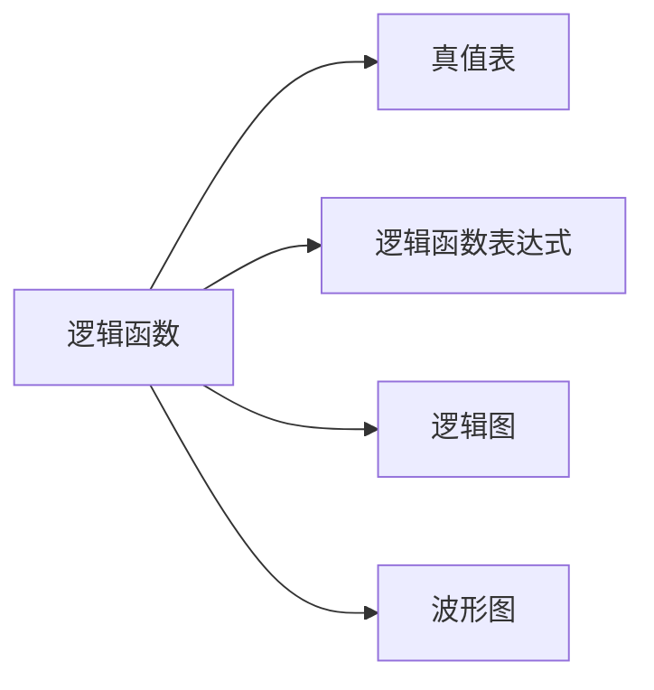

---
{"dg-publish":true,"dg-path":"数字电路/逻辑代数.md","permalink":"/数字电路/逻辑代数/","dgPassFrontmatter":true,"noteIcon":"","created":"2024-04-16T13:01:27.482+08:00","updated":"2024-05-02T16:19:36.991+08:00"}
---

布尔代数

>逻辑代数最早用于开关和继电器网络的分析及化简，随半导体器件制造的发展，各种性能良好的微电子开关器件不断涌现，逻辑代数成为分析和设计逻辑电路不可缺少的数学工具
>利用这种数学工具，可以把逻辑电路输入和输出之间的关系用代数方程表示出来逻辑代数有系列的定律、定理和规则，用它们对数学表达式进行处理，可以完成对逻辑电路的化简、变换分析和设计

[[基本逻辑运算\|基本逻辑运算]]
### 基本定律和恒等式
$$\begin{align}
 A+0&=A\quad  & A\cdot 1&=A \\
  A+1&=A\quad  & A\cdot 0&=0 \\
  A+A&=A\quad  & A\cdot A&=A \\
  A+\overline{A}&=1\quad  & A\cdot \overline{A}&=0 
\end{align}$$

### 基本规则
#### 代入规则
在任何一个表达式中，如果用一个函数代替等式两边出现的某变量，则等式依然成立
#### 反演规则
已知原函数 $L$, 求反函数 $\overline{L}$
1. 与运算 <--> 或运算
2. 原变量 <--> 非变量
3.         0 <--> 1

#### 对偶规则
已知原函数 $L$, 求对偶式 $L'$
1. 与运算 <--> 或运算
2.          0<--> 1

>[!important]- 注意
>保持原来的运算优先，即先进行与运算，后进行或运算，并注意优先考虑括号内的运算
>求反演式时：
>对于非变量以外的非号应该保持不变

### 逻辑函数表达式形式
#### 基本形式
##### 与-或表达式
##### 或-与表达式

#### 最小项最大项表达式
##### 最小项表达式

##### 最大项表达式

### 逻辑函数的化简
#### 代数化简

#### 卡诺图化简
[[卡诺图\|卡诺图]]
