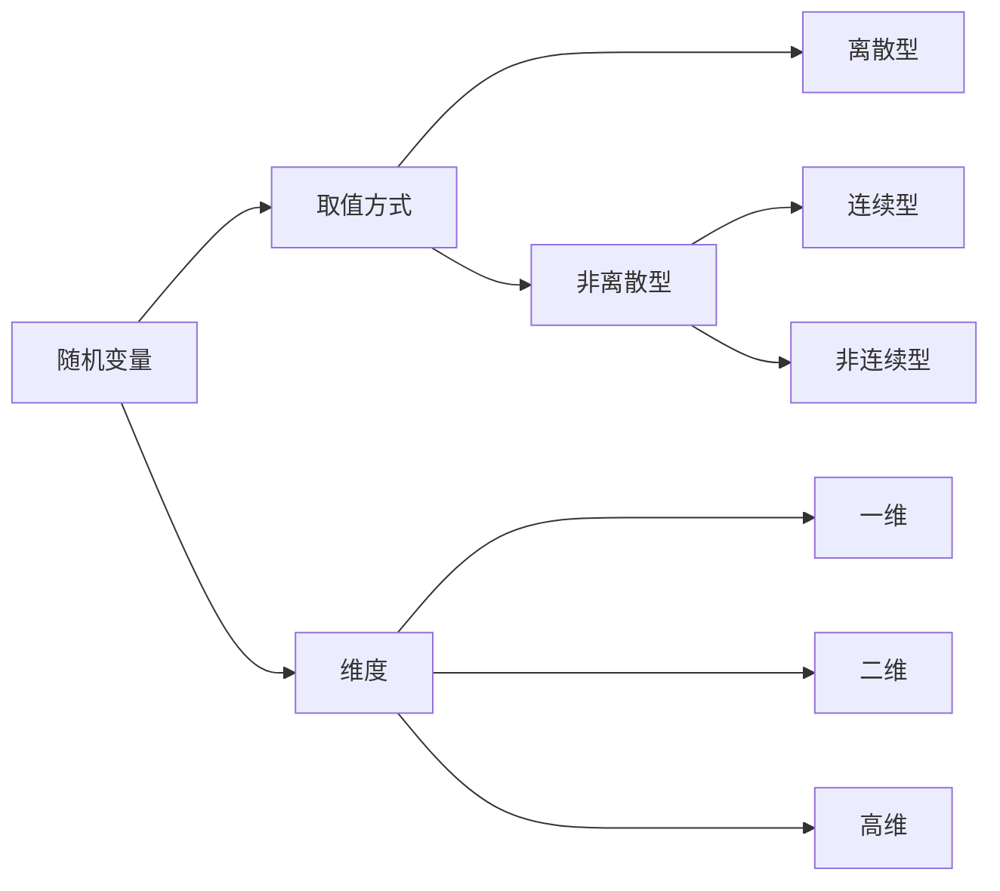

---
{"dg-publish":true,"dg-path":"数学/概率论/随机变量.md","permalink":"/数学/概率论/随机变量/","dgPassFrontmatter":true,"noteIcon":"","created":"2024-05-21T15:20:28.770+08:00","updated":"2024-06-02T13:32:04.854+08:00"}
---

***随机变量：***   
$X\quad Y\quad Z$ 
定义在样本空间 $\Omega$ 上的单值实值[[函数\|函数]] 

对[[样本空间\|样本空间]] $\Omega$ 中每个基本事件 $\omega$ 都有唯一实数 $X(\omega)$ 与之对应，则称 $X(\omega)$ 为随机变量, 简记为 $X$
X, Y, Z 表示随机变量   x, y, z 表示随机变量的取值

1. 定义在样本空间上的函数
2. 取值有一定的概率规律
3. [[随机事件\|随机事件]]从静态的角度研究随机现象，随机变量从动态的角度研究随机现象

按取值的方式不同：
**离散**随机变量：
- 随机变量的取值为有限个或可列个
- 分布函数为右连续的阶梯函数
- 在可能取值上的点的概率不为 0

**连续**随机变量：
- 随机变量的取值为不可列个
- 分布函数为整个实轴上的连续函数
- 在实轴上的任一点的取值概率恒为 0

>不可能事件的概率为 0，但是概率为 0 的事件不一定是不可能事件
>必然事件的概率为 1，但是概率为 1的事件不一定是必然事件

