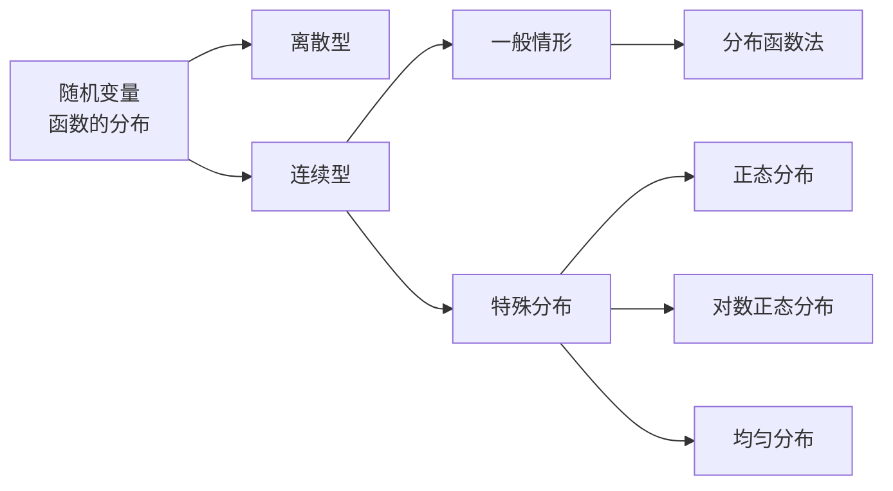

---
{"dg-publish":true,"dg-path":"数学/概率论/随机变量函数的分布.md","tags":["Function"],"permalink":"/数学/概率论/随机变量函数的分布/","dgPassFrontmatter":true,"noteIcon":"","created":"2024-04-16T13:01:27.493+08:00","updated":"2024-08-09T00:12:17.979+08:00"}
---

当[[随机变量\|随机变量]] $X$ 取值为 $x$ 时，随机变量 $Y$ 的取值为 $y=g(x)$
则称 $Y$ 是随机变量 $X$ 的[[函数\|函数]]，记为  $Y=g(X)$
（$g(x)$ 是定义在随机变量 X 的一切可能取值 x 集合上的函数）

## 离散随机变量函数的分布
$X$ 有[[概率分布律\|概率分布律]]
则 $Y$ 的分布律可以表示为：

<svg xmlns="http://www.w3.org/2000/svg" version="1.1" viewBox="0 0 652.3767188952274 454.3298389508718" width="600" height="454.3298389508718">  <!-- svg-source:excalidraw -->    <defs>          </defs>  <rect x="0" y="0" width="652.3767188952274" height="454.3298389508718" fill="#ffffff"/><g stroke-linecap="round"><g transform="translate(11.612897514749022 13.311196283687877) rotate(0 313.1182355762029 1.232675344149584)"><path d="M-0.43 -0.69 C104.04 -0.57, 523.07 1.18, 627.41 1.71 M1.55 1.56 C105.91 1.73, 523.25 2.47, 627.08 2.86" stroke="#1e1e1e" stroke-width="1" fill="none"/></g></g><mask/><g stroke-linecap="round"><g transform="translate(17.993278816544773 207.04975422225107) rotate(0 311.8740104190444 -0.18074568723091033)"><path d="M-0.36 -0.36 C103.76 -0.46, 520.51 -0.19, 624.38 -0.04 M1.65 -1.59 C105.7 -2.12, 519.83 -2.03, 623.77 -1.99" stroke="#1e1e1e" stroke-width="1" fill="none"/></g></g><mask/><g stroke-linecap="round"><g transform="translate(16.626360555686972 109.71159637526353) rotate(0 311.0653955013634 0.9918527578054182)"><path d="M1 -0.83 C104.76 -0.48, 519.85 2.2, 623.28 2.83 M0.06 1.35 C103.71 1.3, 519.52 1.2, 622.93 1.14" stroke="#1e1e1e" stroke-width="1" fill="none"/></g></g><mask/><g stroke-linecap="round"><g transform="translate(120.62770231479828 11.0439554542304) rotate(0 -0.9894983262966264 98.19539816542601)"><path d="M0.13 -1.04 C-0.15 31.87, -1.59 164.12, -1.95 197.21 M-1.26 1.02 C-1.68 33.62, -2.63 163.06, -2.89 195.52" stroke="#1e1e1e" stroke-width="1" fill="none"/></g></g><mask/><g transform="translate(48.41641695053596 54.79045691340025) rotate(0 9.337890625 16.09999999999991)"><text x="0" y="25.760546874999996" font-family="Helvetica, Segoe UI Emoji" font-size="28px" fill="#1e1e1e" text-anchor="start" style="white-space: pre;" direction="ltr" dominant-baseline="alphabetic">X</text></g><g transform="translate(48.36927854096524 145.27455645620057) rotate(0 9.337890625 16.09999999999991)"><text x="0" y="25.760546874999996" font-family="Helvetica, Segoe UI Emoji" font-size="28px" fill="#1e1e1e" text-anchor="start" style="white-space: pre;" direction="ltr" dominant-baseline="alphabetic">P</text></g><g transform="translate(159.89548906587538 56.57052142775092) rotate(0 14.7861328125 16.09999999999991)"><text x="0" y="25.760546874999996" font-family="Helvetica, Segoe UI Emoji" font-size="28px" fill="#1e1e1e" text-anchor="start" style="white-space: pre;" direction="ltr" dominant-baseline="alphabetic">x1</text></g><g transform="translate(157.3309740486372 142.516244068991) rotate(0 15.572265625 16.09999999999991)"><text x="0" y="25.760546874999996" font-family="Helvetica, Segoe UI Emoji" font-size="28px" fill="#1e1e1e" text-anchor="start" style="white-space: pre;" direction="ltr" dominant-baseline="alphabetic">p1</text></g><g transform="translate(241.34508284590567 142.55291426997155) rotate(0 15.572265625 16.09999999999991)"><text x="0" y="25.760546874999996" font-family="Helvetica, Segoe UI Emoji" font-size="28px" fill="#1e1e1e" text-anchor="start" style="white-space: pre;" direction="ltr" dominant-baseline="alphabetic">p2</text></g><g transform="translate(330.83783527495575 143.68264985728865) rotate(0 15.572265625 16.09999999999991)"><text x="0" y="25.760546874999996" font-family="Helvetica, Segoe UI Emoji" font-size="28px" fill="#1e1e1e" text-anchor="start" style="white-space: pre;" direction="ltr" dominant-baseline="alphabetic">p3</text></g><g transform="translate(240.2254070422777 56.15924372049949) rotate(0 14.7861328125 16.09999999999991)"><text x="0" y="25.760546874999996" font-family="Helvetica, Segoe UI Emoji" font-size="28px" fill="#1e1e1e" text-anchor="start" style="white-space: pre;" direction="ltr" dominant-baseline="alphabetic">x2</text></g><g transform="translate(336.43637473884513 55.46552834564818) rotate(0 14.7861328125 16.09999999999991)"><text x="0" y="25.760546874999996" font-family="Helvetica, Segoe UI Emoji" font-size="28px" fill="#1e1e1e" text-anchor="start" style="white-space: pre;" direction="ltr" dominant-baseline="alphabetic">x3</text></g><g transform="translate(402.5780143373723 33.3780097182057) rotate(0 17.920166015625 24.729467975248326)"><text x="0" y="39.567988755912765" font-family="Helvetica, Segoe UI Emoji" font-size="43.0077703917362px" fill="#1e1e1e" text-anchor="start" style="white-space: pre;" direction="ltr" dominant-baseline="alphabetic">...</text></g><g transform="translate(406.7684803487809 130.8932302985363) rotate(0 14.552833557128906 20.082858300634598)"><text x="0" y="32.133255443321815" font-family="Helvetica, Segoe UI Emoji" font-size="34.926710088060226px" fill="#1e1e1e" text-anchor="start" style="white-space: pre;" direction="ltr" dominant-baseline="alphabetic">...</text></g><g transform="translate(494.17606770453136 53.4268304371717) rotate(0 14.7861328125 16.09999999999991)"><text x="0" y="25.760546874999996" font-family="Helvetica, Segoe UI Emoji" font-size="28px" fill="#1e1e1e" text-anchor="start" style="white-space: pre;" direction="ltr" dominant-baseline="alphabetic">xn</text></g><g transform="translate(490.3506801442865 141.82806457466359) rotate(0 15.572265625 16.09999999999991)"><text x="0" y="25.760546874999996" font-family="Helvetica, Segoe UI Emoji" font-size="28px" fill="#1e1e1e" text-anchor="start" style="white-space: pre;" direction="ltr" dominant-baseline="alphabetic">pn</text></g><g stroke-linecap="round"><g transform="translate(10.674014297127712 249.16589484359474) rotate(0 313.1182355762029 1.232675344149584)"><path d="M-0.67 -0.94 C103.38 -0.35, 521.09 2.82, 625.42 3.56 M1.17 1.17 C105.51 1.46, 523.29 1.92, 627.7 2.02" stroke="#1e1e1e" stroke-width="1" fill="none"/></g></g><mask/><g stroke-linecap="round"><g transform="translate(17.054395598923463 442.9044527821575) rotate(0 311.8740104190444 -0.18074568723091033)"><path d="M-0.82 1.1 C103.09 1.37, 518.82 1.05, 622.77 0.69 M0.95 0.63 C105.28 0.67, 520.91 -0.76, 624.98 -0.88" stroke="#1e1e1e" stroke-width="1" fill="none"/></g></g><mask/><g stroke-linecap="round"><g transform="translate(15.687477338065662 345.5662949351704) rotate(0 311.0653955013634 0.9918527578054182)"><path d="M-0.97 1.05 C102.71 1.09, 517.59 1.21, 621.27 1.31 M0.72 0.56 C104.85 1.25, 519.74 2.11, 623.53 2.49" stroke="#1e1e1e" stroke-width="1" fill="none"/></g></g><mask/><g stroke-linecap="round"><g transform="translate(119.68881909717697 246.89865401413635) rotate(0 -0.9894983262966264 98.19539816542601)"><path d="M-0.86 -0.68 C-1.2 31.82, -2.7 163.23, -3.02 196.06 M0.88 1.58 C0.99 34.78, -0.66 164.76, -0.85 197.43" stroke="#1e1e1e" stroke-width="1" fill="none"/></g></g><mask/><g transform="translate(47.47753373291465 290.6451554733071) rotate(0 9.337890625 16.09999999999991)"><text x="0" y="25.760546874999996" font-family="Helvetica, Segoe UI Emoji" font-size="28px" fill="#1e1e1e" text-anchor="start" style="white-space: pre;" direction="ltr" dominant-baseline="alphabetic">Y</text></g><g transform="translate(47.43039532334393 381.12925501610744) rotate(0 9.337890625 16.09999999999991)"><text x="0" y="25.760546874999996" font-family="Helvetica, Segoe UI Emoji" font-size="28px" fill="#1e1e1e" text-anchor="start" style="white-space: pre;" direction="ltr" dominant-baseline="alphabetic">P</text></g><g transform="translate(140.73138830936148 287.7633398006842) rotate(0 31.896484375 16.09999999999991)"><text x="0" y="25.760546874999996" font-family="Helvetica, Segoe UI Emoji" font-size="28px" fill="#1e1e1e" text-anchor="start" style="white-space: pre;" direction="ltr" dominant-baseline="alphabetic">g(x1)</text></g><g transform="translate(156.39209083101588 378.3709426288974) rotate(0 15.572265625 16.09999999999991)"><text x="0" y="25.760546874999996" font-family="Helvetica, Segoe UI Emoji" font-size="28px" fill="#1e1e1e" text-anchor="start" style="white-space: pre;" direction="ltr" dominant-baseline="alphabetic">p1</text></g><g transform="translate(240.40619962828436 378.40761282987796) rotate(0 15.572265625 16.09999999999991)"><text x="0" y="25.760546874999996" font-family="Helvetica, Segoe UI Emoji" font-size="28px" fill="#1e1e1e" text-anchor="start" style="white-space: pre;" direction="ltr" dominant-baseline="alphabetic">p2</text></g><g transform="translate(329.8989520573344 379.5373484171946) rotate(0 15.572265625 16.09999999999991)"><text x="0" y="25.760546874999996" font-family="Helvetica, Segoe UI Emoji" font-size="28px" fill="#1e1e1e" text-anchor="start" style="white-space: pre;" direction="ltr" dominant-baseline="alphabetic">p3</text></g><g transform="translate(318.732269747471 290.0628366539372) rotate(0 31.896484375 16.09999999999991)"><text x="0" y="25.760546874999996" font-family="Helvetica, Segoe UI Emoji" font-size="28px" fill="#1e1e1e" text-anchor="start" style="white-space: pre;" direction="ltr" dominant-baseline="alphabetic">g(x3)</text></g><g transform="translate(401.63913111975097 269.23270827811257) rotate(0 17.920166015625 24.729467975248326)"><text x="0" y="39.567988755912765" font-family="Helvetica, Segoe UI Emoji" font-size="43.0077703917362px" fill="#1e1e1e" text-anchor="start" style="white-space: pre;" direction="ltr" dominant-baseline="alphabetic">...</text></g><g transform="translate(409.60179551428456 368.00531911006055) rotate(0 14.552833557128906 20.082858300634598)"><text x="0" y="32.133255443321815" font-family="Helvetica, Segoe UI Emoji" font-size="34.926710088060226px" fill="#1e1e1e" text-anchor="start" style="white-space: pre;" direction="ltr" dominant-baseline="alphabetic">...</text></g><g transform="translate(484.8544907152199 286.76674849384244) rotate(0 31.896484375 16.09999999999991)"><text x="0" y="25.760546874999996" font-family="Helvetica, Segoe UI Emoji" font-size="28px" fill="#1e1e1e" text-anchor="start" style="white-space: pre;" direction="ltr" dominant-baseline="alphabetic">g(xn)</text></g><g transform="translate(496.95613843637267 381.0358406432456) rotate(0 15.572265625 16.09999999999991)"><text x="0" y="25.760546874999996" font-family="Helvetica, Segoe UI Emoji" font-size="28px" fill="#1e1e1e" text-anchor="start" style="white-space: pre;" direction="ltr" dominant-baseline="alphabetic">pn</text></g><g transform="translate(228.49737859866957 288.59316802753665) rotate(0 31.896484375 16.09999999999991)"><text x="0" y="25.760546874999996" font-family="Helvetica, Segoe UI Emoji" font-size="28px" fill="#1e1e1e" text-anchor="start" style="white-space: pre;" direction="ltr" dominant-baseline="alphabetic">g(x2)</text></g><g transform="translate(575.3640223301354 36.15129389317735) rotate(0 17.920166015625 24.729467975248326)"><text x="0" y="39.567988755912765" font-family="Helvetica, Segoe UI Emoji" font-size="43.0077703917362px" fill="#1e1e1e" text-anchor="start" style="white-space: pre;" direction="ltr" dominant-baseline="alphabetic">...</text></g><g transform="translate(567.2753475673314 121.5978192288112) rotate(0 17.920166015625 24.729467975248326)"><text x="0" y="39.567988755912765" font-family="Helvetica, Segoe UI Emoji" font-size="43.0077703917362px" fill="#1e1e1e" text-anchor="start" style="white-space: pre;" direction="ltr" dominant-baseline="alphabetic">...</text></g><g transform="translate(568.787683469455 269.6454595685623) rotate(0 17.920166015625 24.729467975248326)"><text x="0" y="39.567988755912765" font-family="Helvetica, Segoe UI Emoji" font-size="43.0077703917362px" fill="#1e1e1e" text-anchor="start" style="white-space: pre;" direction="ltr" dominant-baseline="alphabetic">...</text></g><g transform="translate(570.1166510035207 365.3345960513434) rotate(0 17.920166015625 24.729467975248326)"><text x="0" y="39.567988755912765" font-family="Helvetica, Segoe UI Emoji" font-size="43.0077703917362px" fill="#1e1e1e" text-anchor="start" style="white-space: pre;" direction="ltr" dominant-baseline="alphabetic">...</text></g></svg>

当 $g(x_{i})$ 中有某些值相等，将相等的值合并，概率相加即可

>[!important] 注意
>不要想的过于复杂，离散化的很简单，也很好处理
>根据函数关系 $Y=g(X)$ 找到对应的函数值以及对应的概率，列表即可

#### 例题
$X$   1    2      3    $\cdots$     n    $\cdots$  
$p_{k}$   $\dfrac{1}{2}$  $\dfrac{1}{2^{2}}$  $\dfrac{1}{2^{3}}$  $\cdots$    $\dfrac{1}{2^{n}}$   $\cdots$  
$Y=\sin(\dfrac{\pi}{2}X)$ 的分布律？

$$\sin(\dfrac{n}{2}\pi)=\begin{cases}
-1  & n=4k-1 \\
0  & n=2k \\
1  & n=4k-3
\end{cases}$$

所以 $Y$ 只可能取 $-1,0,1$
$P\left\{Y=-1 \right\}= \dfrac{1}{2^{3}}+\dfrac{1}{2^{7}}+\cdots+ \dfrac{1}{2^{4k-1}}+\cdots= \dfrac{\frac{1}{2^{3}}}{1- \frac{1}{2^{4}}}=\dfrac{2}{15}$   等比级数求和
同理 $P\left\{Y=0 \right\}= \dfrac{1}{3}$   $P\left\{Y=1 \right\}= \dfrac{8}{15}$

## 连续随机变量函数的分布
### 分布函数法
**先找 Y 的[[分布函数\|分布函数]]，再求导得出 Y 的[[概率密度函数\|概率密度函数]]**
（完全按照定义得到，很好思考）

$$\begin{align}
Y&=g(X) \\
X&=g^{-1}(Y)=h(Y) 
\end{align}$$

$$\begin{align} 
F_{Y}(y)&=P\left\{Y\leq y \right\} \\
&=P\left\{g(X)\leq y \right\}  \\
&=P\left\{X\leq h(y) \right\}\\
&=\int  \limits _{x\leq h(y)}f_{X}(x)\, dx \\
f_{Y}(y)&=F'_{Y}(y) 
\end{align}$$

>[!important] 本质
>就是根据分布函数和概率密度函数的定义
>一步步代换，求得函数的密度函数

#### 当 $g(x)$ 严格单调时
如果 $g(x)$ 单调递增：
$$\begin{align} 
F_{Y}(y)&=P\left\{Y\leq y \right\} \\
&=P\left\{g(X)\leq y \right\} \\
&=P\left\{X\leq g^{-1}(y) \right\} \\
&=\int _{-\infty}^{h(y)} f_{X}(x)\, dx   \\
f_{Y}(y)&=F'_{Y}(y)=f_{X}(h(y))h'(y)
\end{align}$$
如果 $g(x)$ 单调递减：
$$\begin{align} 
F_{Y}(y)&=P\left\{Y\leq y \right\} \\
&=P\left\{g(X)\leq y \right\} \\
&=P\left\{X\geq g^{-1}(y) \right\} \\
&=\int _{h(y)}^{+\infty} f_{X}(x)\, dx   \\
f_{Y}(y)&=F'_{Y}(y)=-f_{X}(h(y))h'(y)
\end{align}$$
综上：
$$f_{Y}(y)=\begin{cases}
f_{X}[h(y)]\cdot|h'(y)|\quad  \\ \\
\quad \quad 0
\end{cases}$$

#### 当 $g(x)$ 为其他形式时
也是使用分布函数法求分布函数和概率密度函数
注意要对 y 进行分类讨论

### 特殊分布的函数的分布
#### 正态分布
$X  \sim N(\mu,\sigma^{2})$
$Y=aX+b \sim N(a\mu+b,a^{2}\sigma^{2})$
[[正态分布\|正态分布]]的[[线性变换\|线性变换]]仍为正态分布
$E(Y)=a\mu+b$
$D(Y)= a^{2}\sigma^{2}$

#### 对数正态分布
$X\sim N(\mu,\sigma^{2})$
$Y=e^{ X }\sim LN(\mu,\sigma^{2})$

$$f_{Y}(y)=\begin{cases}
 \dfrac{1}{\sqrt{ 2\pi }y\sigma}\exp\left[-\dfrac{(\ln y-\mu)^{2}}{2\sigma^{2}}\right] \quad  y>0\\
 \\
\quad \quad 0\quad  \quad  \quad y\leq 0
\end{cases}$$

$$\begin{align}
y&=e^{ x }  \quad  x=h(y)=\ln y \quad  (\ln y)'= \dfrac{1}{y}\\
F_{Y}(y)&=F_{X}(h(y)) h'(y) \\
&=\dfrac{1}{\sqrt{ 2\pi }\sigma} \exp\left[-\dfrac{(\ln y-\mu)^{2}}{2\sigma^{2}}\right]  \cdot  \dfrac{1}{y}
\end{align}$$

#### 均匀分布
若 $X$ 的分布函数 $F_{X}(x)$ 为严格单调增的连续函数，其反函数 $F_{X}^{-1}(x)$ 存在，则 $Y=F_{X}(X)$ 服从 $(0,1)$ 上的[[均匀分布\|均匀分布]]
$$\begin{align}
Y&=F_{X}(X) \\
F_{Y}(y)&=P\left\{F_{X}(X)\leq y \right\} \\
&=P\left\{X\leq F_{X}'(y) \right\} \\
&=F_{X}(F_{X}'(y)) \\
&=y \\
Y&=F_{X}(X)\sim U(0,1)
\end{align}$$
>[!important] 意义
>可以通过均匀分布的随机数产生其他分布的随机数
>例如产生[[指数分布\|指数分布]]的随机数：
> $Y=F_{X}(X)=1- e^{ -\lambda X }\sim U(0,1)$
> 反解：$X=- \dfrac{\ln(1-Y)}{\lambda}$  $X\sim Exp(\lambda)$

