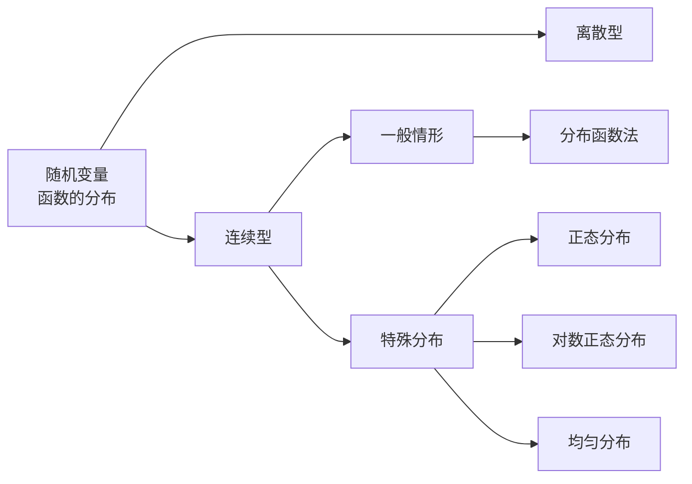

---
{"dg-publish":true,"dg-path":"数学/概率论/随机变量函数的分布.md","permalink":"/数学/概率论/随机变量函数的分布/","dgPassFrontmatter":true,"noteIcon":"","created":"2024-04-16T13:01:27.493+08:00","updated":"2024-05-07T12:41:02.470+08:00"}
---

当[[随机变量\|随机变量]] $X$ 取值为 $x$ 时，随机变量 $Y$ 的取值为 $y=g(x)$
则称 $Y$ 是随机变量 $X$ 的[[函数\|函数]]，记为  $Y=g(X)$
（$g(x)$ 是定义在随机变量 X 的一切可能取值 x 集合上的函数）

## 离散随机变量函数的分布
$X$ 有[[概率分布律\|概率分布律]]

| $X$ | $x_{1}$ | $x_{2}$ | $\cdots$ | $x_{n}$ |
| --- | ------- | ------- | -------- | ------- |
| $P$ | $p_{1}$ | $p_{2}$ | $\cdots$ | $p_{n}$ |

则 $Y$ 的分布律可以简单地表示为：

| $Y$ | $g(x_{1})$ | $g(x_{2})$ | $\cdots$ | $g(x_{n})$ |
| --- | ---------- | ---------- | -------- | ---------- |
| $P$ | $p(x_{1})$ | $p(x_{2})$ | $\cdots$ | $p(x_{n})$ |

当 $g(x_{i})$ 中有某些值相等，将相等的值合并，概率相加即可
## 连续随机变量函数的分布
### 分布函数法
**分布函数法**：
**先找 Y 的[[分布函数\|分布函数]]，再求导得出 Y 的[[概率密度函数\|概率密度函数]]**
$$\begin{align}
Y&=g(X) \\
X&=g^{-1}(Y)=h(Y) 
\end{align}$$
$$\begin{align} 
F_{Y}(y)&=P\left\{Y\leq y \right\} \\
&=P\left\{g(X)\leq y \right\} \\
&=\int  \limits _{g(x)\leq y}f_{X}(x)\, dx \\
f_{Y}(y)&=F'_{Y}(y) 
\end{align}$$
>[!important] 
>就是根据分布函数和概率密度函数的定义
>一步步代换，求得函数的密度函数
#### 当 $g(x)$ 严格单调时
如果 $g(x)$ 单调递增：
$$\begin{align} 
F_{Y}(y)&=P\left\{Y\leq y \right\} \\
&=P\left\{g(X)\leq y \right\} \\
&=P\left\{X\leq g^{-1}(y) \right\} \\
&=\int _{-\infty}^{h(y)} f_{X}(x)\, dx   \\
f_{Y}(y)&=F'_{Y}(y)=f_{X}(h(y))h'(y)
\end{align}$$
如果 $g(x)$ 单调递减：
$$\begin{align} 
F_{Y}(y)&=P\left\{Y\leq y \right\} \\
&=P\left\{g(X)\leq y \right\} \\
&=P\left\{X\geq g^{-1}(y) \right\} \\
&=\int _{h(y)}^{+\infty} f_{X}(x)\, dx   \\
f_{Y}(y)&=F'_{Y}(y)=-f_{X}(h(y))h'(y)
\end{align}$$
综上：
$$f_{Y}(y)=\begin{cases}
f_{X}[h(y)]\cdot|h'(y)|\quad  \\ \\
\quad \quad 0
\end{cases}$$

#### 当 $g(x)$ 为其他形式时
也是使用分布函数法求分布函数和概率密度函数
注意要对 y 进行分类讨论

### 特殊分布的函数的分布
#### 正态分布
$X  \sim N(\mu,\sigma^{2})$
$Y=aX+b \sim N(a\mu+b,a^{2}\sigma^{2})$
[[正态分布\|正态分布]]的线性变换仍为正态分布

#### 对数正态分布
$X\sim N(\mu,\sigma^{2})$
$Y=e^{ x }\sim LN(\mu,\sigma^{2})$
$$f_{Y}(y)=\begin{cases}
 \dfrac{1}{\sqrt{ 2\pi }y\sigma}\exp\left[-\dfrac{\ln y-\mu}{2\sigma^{2}}\right] \\
 \\
\quad 0
\end{cases}$$
#### 均匀分布
若 $X$ 的分布函数 $F_{X}(x)$ 为严格单调增的连续函数，其反函数 $F_{X}^{-1}(x)$ 存在，则 $Y=F_{X}(X)$ 服从 $(0,1)$ 上的[[均匀分布\|均匀分布]]
$$\begin{align}
Y&=F_{X}(X) \\
F_{Y}(y)&=P\left\{F_{X}(X)\leq y \right\} \\
&=P\left\{X\leq F_{X}'(y) \right\} \\
&=F_{X}(F_{X}'(y)) \\
&=y \\
Y&=F_{X}(X)\sim U(0,1)
\end{align}$$
>[!important] 意义
>可以通过均匀分布的随机数产生其他分布的随机数

