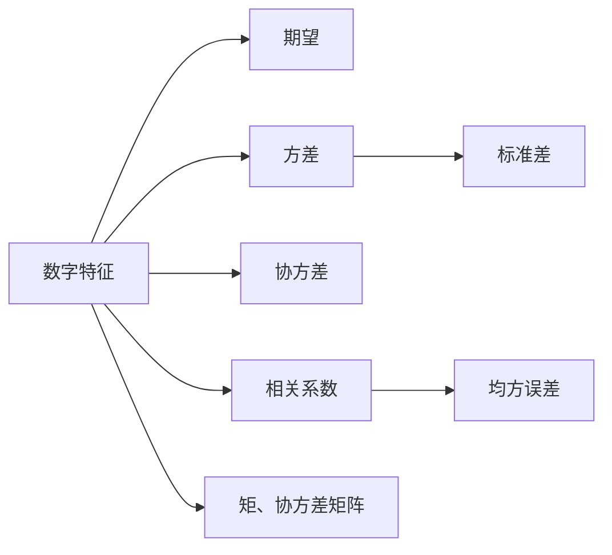

---
{"dg-publish":true,"dg-path":"数学/概率论/随机变量的数字特征.md","permalink":"/数学/概率论/随机变量的数字特征/","dgPassFrontmatter":true,"noteIcon":"","created":"2024-04-19T18:32:13.642+08:00","updated":"2024-05-04T17:03:55.278+08:00"}
---

[[随机变量\|随机变量]]
[[随机变量函数的分布\|随机变量函数的分布]]对随机变量的概率性质进行了**最完整的刻画，包含了全部信息**
而随机变量的数字特征**更集中、更概括**地反映随机变量的特征

### 相关章节
[[期望\|期望]]
[[方差\|方差]]
[[协方差\|协方差]]
[[相关系数\|相关系数]]
[[协方差矩阵\|协方差矩阵]]

