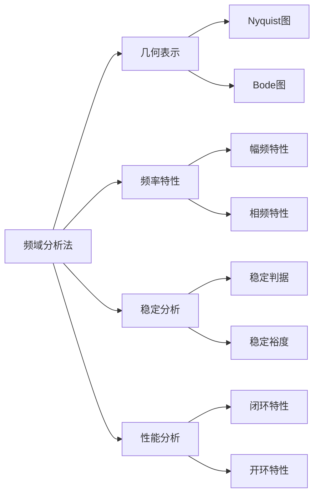

---
{"dg-publish":true,"permalink":"/频域分析法/","dgPassFrontmatter":true,"noteIcon":"","created":"2024-05-21T15:20:28.795+08:00","updated":"2024-05-21T15:52:11.641+08:00"}
---

**Frequency-Response Analysis**

对[[正弦信号\|正弦信号]]输入，研究[[频率\|频率]]特性

### 频率特性
[[传递函数\|传递函数]]决定
#### 定义一
输入信号： $A\sin(\omega t)$
输出信号： $B\sin(\omega t+\phi)$
**幅频特性**： $\dfrac{B}{A}$
**相频特性**：$\phi$

#### 定义二
传递函数： $G(s)$
$s\to j\omega$
$G(j\omega)=|G(j\omega)|e^{ j \angle G(j\omega) }$ 

输入信号： $A\sin(\omega t)$
输出信号： $A|G(j\omega)|\sin(\omega t+\angle G(j\omega))$
**幅频特性**：$|G(j\omega)|$
**相频特性**： $\angle G(j\omega)$

[[复数\|复数的指数表示]]

>[!important] 注意！
>频域分析法中的 $\omega$ (无论是 Bode 图、 Nyquist 图，还是稳定裕度的计算)
>都应该是以弧度为单位的

### 幅相曲线图
[[Nyquist图\|Nyquist图]]
### 对数频率特性图
[[Bode图\|Bode图]]

### 频域稳定判据
[[频域稳定判据\|频域稳定判据]]

### 稳定裕度
[[稳定裕度\|稳定裕度]]

[[闭环系统频域性能指标\|闭环系统频域性能指标]]
[[开环频率特性分析性能\|开环频率特性分析性能]]

