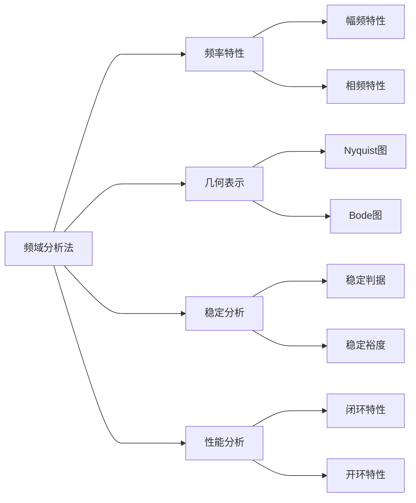

---
{"dg-publish":true,"dg-path":"自动控制原理/经典控制理论/频域分析法.md","permalink":"/自动控制原理/经典控制理论/频域分析法/","dgPassFrontmatter":true,"noteIcon":"","created":"2024-05-21T15:20:28.795+08:00","updated":"2025-04-13T15:22:00.465+08:00"}
---

>[!important] 注意！
>本节的内容重点是：利用==开环频率特性==研究系统的稳定性，Bode 图和 Nyquist 图，以及稳定裕度的相关概念，是基于开环传递函数画的。
>但是提及系统的输出或稳态误差的计算，是根据==闭环传递函数==进行分析的。
>
>频域分析法中的 $\omega$ (无论是 Bode 图、 Nyquist 图，还是稳定裕度的计算)都应该是以弧度为单位的
### 基本结构

