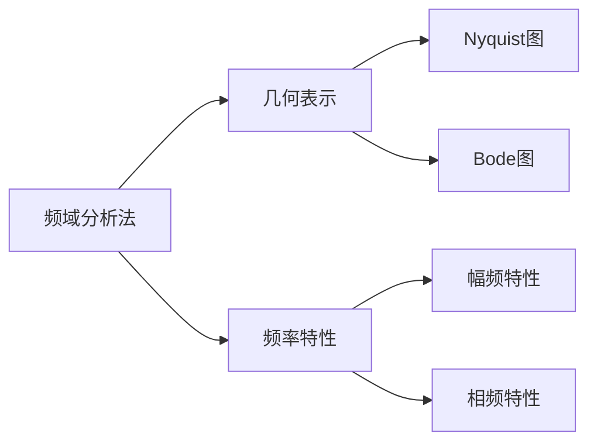

---
{"dg-publish":true,"permalink":"/频域分析法/","dgPassFrontmatter":true,"noteIcon":"","created":"2024-04-03T10:46:02.503+08:00","updated":"2024-05-16T22:56:07.266+08:00"}
---

**Frequency-Response Analysis**

对[[正弦信号\|正弦信号]]输入，研究[[频率\|频率]]特性

### 频率特性
[[传递函数\|传递函数]]决定
#### 定义一
输入信号： $A\sin(\omega t)$
输出信号： $B\sin(\omega t+\phi)$
幅频特性： $\dfrac{B}{A}$
相频特性：$\phi$
#### 定义二
传递函数： $G(s)$
$s\to j\omega$
$G(j\omega)=|G(j\omega)|e^{ j \angle G(j\omega) }$ 

输入信号： $A\sin(\omega t)$
输出信号： $A|G(j\omega)|\sin(\omega t+\angle G(j\omega))$
幅频特性：$|G(j\omega)|$
相频特性： $\angle G(j\omega)$
[[复数\|复数的指数表示]]

### 幅相曲线图
[[Nyquist图\|Nyquist图]]
### 对数频率特性图
[[Bode图\|Bode图]]

### 幅角原理
在复平面 $[s]$ 任取一条闭合曲线 $\Gamma$，包围 $F (s)$ 的 Z 个零点和 P 个极点，且不通过 $F (s)$ 的任何零点和极点
当复变量 s 沿曲线 $\Gamma$ 顺时针绕一周时，在平面 $[F]$ 上，$\Gamma_{F}$包围原点的圈数$R=P-Z$

