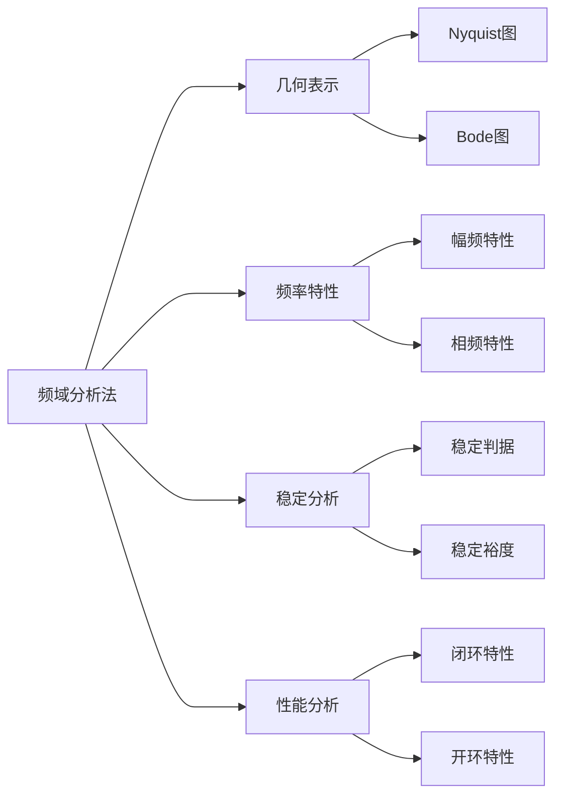

---
{"dg-publish":true,"dg-path":"自动控制原理/频域分析法.md","permalink":"/自动控制原理/频域分析法/","dgPassFrontmatter":true,"noteIcon":"","created":"2024-05-21T15:20:28.795+08:00","updated":"2024-05-26T20:16:27.050+08:00"}
---

**Frequency-Response Analysis**
对[[正弦信号\|正弦信号]]输入，研究[[频率\|频率]]特性

[[频率特性\|频率特性]]
[[Nyquist图\|Nyquist图]]
[[Bode图\|Bode图]]
[[频域稳定判据\|频域稳定判据]]
[[稳定裕度\|稳定裕度]]
[[频带宽度\|频带宽度]]
[[开环频率特性分析性能\|开环频率特性分析性能]]

>[!important] 注意！
>频域分析法中的 $\omega$ (无论是 Bode 图、 Nyquist 图，还是稳定裕度的计算)
>都应该是以弧度为单位的

