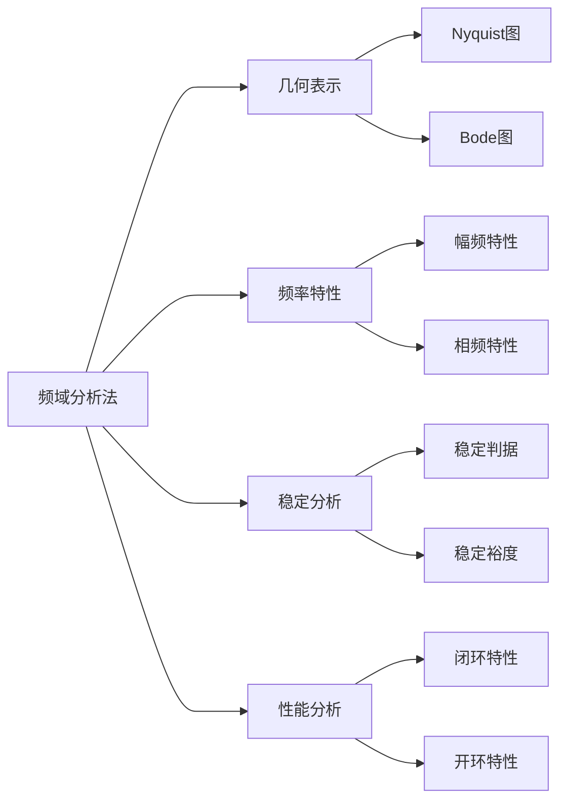

---
{"dg-publish":true,"dg-path":"自动控制原理/频域分析法.md","permalink":"/自动控制原理/频域分析法/","dgPassFrontmatter":true,"noteIcon":"","created":"2024-05-21T15:20:28.795+08:00","updated":"2024-08-25T20:58:55.873+08:00"}
---

(terminology::**Frequency-Response Analysis**)

对正弦信号输入，研究[[频率\|频率]]特性
控制系统对不同频率正弦信号的响应全面反映系统的各种性质

[[频率特性\|频率特性]]
-  [[Nyquist图\|Nyquist图]]
-  [[Bode图\|Bode图]]

[[经典环节的传递函数\|经典环节的传递函数]]

>[!important] 注意！
>本节的内容重点是：利用==开环频率特性==研究系统的稳定性
>Bode 图和 Nyquist 图，及稳定裕度的相关概念，是基于开环传递函数画的
>
>但是提及系统的输出或稳态误差的计算，是根据闭环传递函数进行分析的

**稳定性的判断：**
[[频域稳定判据\|频域稳定判据]]

**相对稳定性：**
[[稳定裕度\|稳定裕度]]

**闭环系统频域性能指标:**
[[频带宽度\|频带宽度]]
[[开环频率特性分析性能\|开环频率特性分析性能]]

>[!important] 注意！
>频域分析法中的 $\omega$ (无论是 Bode 图、 Nyquist 图，还是稳定裕度的计算)
>都应该是以弧度为单位的

