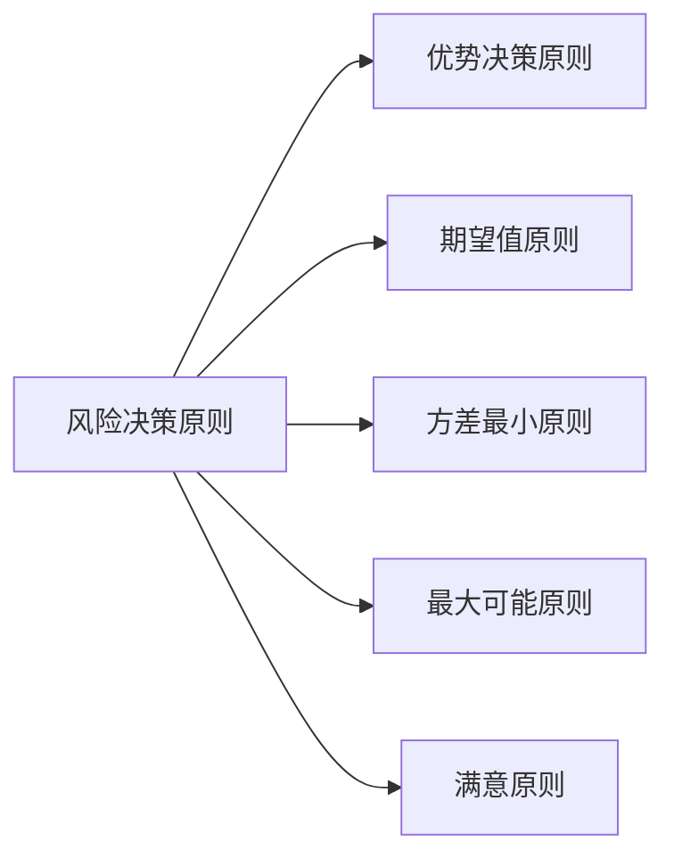

---
{"dg-publish":true,"dg-path":"技术经济与工程管理/风险决策.md","permalink":"/技术经济与工程管理/风险决策/","dgPassFrontmatter":true,"noteIcon":"","created":"2024-04-25T14:47:34.721+08:00","updated":"2024-04-26T23:18:25.156+08:00"}
---

### 风险决策的基本原则
**优势原则**
	能够减少备选方案的数目
	如果某方案在任何条件下都优于另一方案, 则可直接排除另一方案 

**期望值原则**
	选择**净现值**的期望值最**大**的方案
	或**费用现值**的期望值最**小**的方案

**方差最小原则**
	选经济效果指标的方差最小的方案

**最大可能原则**
	如果一种状态发生的概率显著大于其他状态，那么就把这种状态视作肯定状态，根据这种状态下各方案的经济效果指标来进行决策。 
	按照最大可能原则决策实际上将风险决策问题转化为确定性决策问题

**满意原则**
	定出一个足够满意的目标值，将各备选方案在不同状态下的经济效果指标与此目标值进行比较，选择经济效果指标优于或等于目标值的概率最大的方案

### 决策方法
**使用期望值原则**
#### 矩阵法
#### 决策树法

