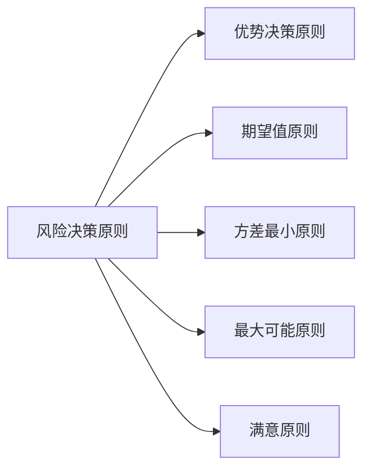

---
{"dg-publish":true,"dg-path":"技术经济与工程管理/风险决策.md","permalink":"/技术经济与工程管理/风险决策/","dgPassFrontmatter":true,"noteIcon":"","created":"2024-05-21T15:20:28.802+08:00","updated":"2024-05-31T19:05:30.459+08:00"}
---

### 风险决策的基本原则
**优势原则**
	能够减少备选方案的数目
	如果某方案在任何条件下都优于另一方案, 则可直接排除另一方案 

**期望值原则**
	选择**净现值**的期望值最**大**的方案
	或**费用现值**的期望值最**小**的方案

**方差最小原则**
	选经济效果指标的方差最小的方案

**最大可能原则**
	如果一种状态发生的概率显著大于其他状态，那么就把这种状态视作肯定状态，根据这种状态下各方案的经济效果指标来进行决策。 
	按照最大可能原则决策实际上将风险决策问题转化为确定性决策问题

**满意原则**
	定出一个足够满意的目标值，将各备选方案在不同状态下的经济效果指标与此目标值进行比较，选择经济效果指标优于或等于目标值的概率最大的方案

### 决策方法
**使用期望值原则**
#### 矩阵法
多标准决策技术，它通过构建一个[[矩阵\|矩阵]]来评估和比较不同决策方案。这种方法特别适用于当决策需要考虑多个目标或标准时

#### 决策树法
一种图形化的工具，用于表示决策过程中的决策点、结果和概率。它特别适用于包含序列决策和随机事件的情况

1. **定义决策问题**：明确需要解决的决策问题。
2. **绘制决策树**：从左到右绘制决策树，从根节点（决策者当前的位置）开始，然后是决策点（决策者需要做出的决策）和结果节点（每个决策可能的结果）。
3. **确定分支**：为每个决策点确定可能的分支，每个分支代表一个决策选项。
4. **评估结果**：为每个结果节点分配一个结果值（如收益、成本等）。
5. **计算期望值**：对于每个决策点，计算期望值，考虑每个结果的概率和相应的结果值。
6. **选择最优路径**：从根节点开始，选择期望值最高的路径，直到达到最终决策。
7. **敏感性分析**：评估不同假设和概率对决策的影响。

