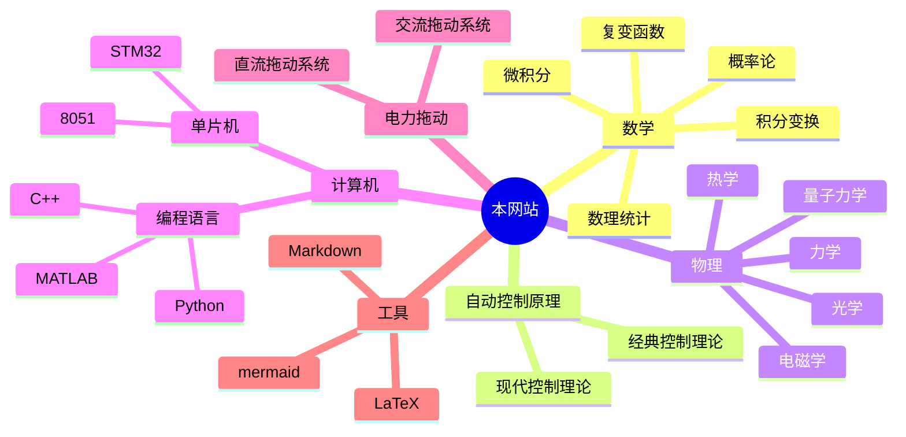

# Learn Everything!
This is a project based on Obsidian + Digital Garden + Vercel    (**[English](https://github.com/UNLINEARITY/Learn-for-Everything/blob/main/translation/English.md)**) 

  

你可以访问这个[网站](https://www.unlinearity.top),看看所搭建成果!   

***

## 一、核心的思想
>***你是否经常听到：积分很有用/线性代数在之后的学习里有帮助/量子力学/电磁学/电机/算法... 诸如此类的说辞***  

>***或者经常在想：我学xx课程究竟对之后的学习生活有什么帮助?学习这些知识有什么意义?***

在我们成长和不断学习的过程中，我们会接触到很多影响深远的理念，会产生很多灵光乍现的想法，会惊叹于诸多前人的思想和理论

可是概念太多了，我们也许会惊叹一时，也许会被影响很久，但是终究会被个体遗忘
***
这就是本库存在的意义！

该项目旨在构建以**双向链接**和**关系图谱**为核心的知识库

  

强调知识与知识之间的联系，注重数理基础，深入探讨数学与物理知识在各个领域的作用与影响

- 主体文件为Markdown(即.md文件)
- 数学公式使用Latex语法渲染
- 笔记之间的关系使用简单的Wiki语法呈现

本项目长期的三步规划：
1. 初步构建基础知识、通识知识之间的联系
2. 将基础知识与细分的专业知识相联系
3. 将所有前置的知识与实际的生活、实际的工作相联系

***

### 二、该网站预期覆盖的人群

#### 1. 开源项目的初学者
本项目就是基于最为基础的 **Markdown** 语法的 `.md` 文件渲染的
理论上只要会打字，会 **git**  就能参与进来

要做的工作也不用很多，可以更改几个句子
也可以增加一两篇特定的知识点
#### 2. 高校学生
由于本项目即将覆盖最为基础的通识性数理课程
也将覆盖自动化类的专业课

可以利用此网站进行简要的复习，或是了解知识点之间的联系

#### 3. 高校教师
可能谋求与高校老师合作

共同建设网站，引入新的思想来进行教学改革

#### 4. 参与实际工作的人

实际的工作与生活中，
往往需要用到最为基础的数理知识，

本项目的终极目标就是希望能建立起基础知识与真实世界的联系

***

## 三、网站的内容

### 目前该网站**涵盖**并**持续更新**的内容！！！
**较为完善的部分：**
- [x] 自动控制原理——经典控制理论
- [x] 电机与电力拖动
- [x] 概率论
- [x] 数理统计
- [x] 复变函数与积分变换
- [x] 微机原理——8051基础部分

**近期将更新的部分：**
- [x] 物理
  - [x] 电磁学
- [x] 线性代数
- [x] manim

**之后逐步添加的内容**
- [x] 机器学习
- [x] 哲学
- [ ] 生物
  - [ ] 生态学

***

## 四、参与到网站的建设中
- 如果在网站中发现有错误或者存在问题
- 如果你觉得笔记之间的关系过乱，或者设置的正反向链接不够合理
- 如果你觉得网站的功能不够完善
- 如果你想贡献新的分支
- ......

### 1.对网站已有的知识的修改
笔记的原Markdown文件在本库的src/site/notes[目录](https://github.com/UNLINEARITY/Learn-Everything/tree/main/src/site/notes)下，可以随时查看

### 2.贡献新的知识分支
可以在本网站的**Contributions**中添加属于自己的文件夹，增加独属于自己的分支！

具体贡献步骤可以查看该文件夹中的[readme文件](https://github.com/UNLINEARITY/Learn-for-Everything/tree/main/Contributions)

**相信我，非常简单！**  ~~但是要做好工作可能有点难度，要保证网站的整体质量~~

### 3.对网站本身的功能和架构的调整
如果你觉得网站应该具有一些新的功能，并且有能力完善，你可以随时对网站作出调整
比如可能实现的功能？
已实现：

~~- [x] 为文章点赞、评论~~  ,本来已经实现了，但是考虑实际用途不大，还是删去了

未实现：
- [ ] 中英文切换？
- [ ] 深色模式？
- [ ] 3D显示知识图谱

***
## 五、该网站目前存在的问题
- 由于本项目的构建者并非为计算机专业出身，对网站构建的知识不够了解，没有实现很多网站具备的功能
- 服务器部署于Vercel，在国内不能流畅访问，而且限于免费版的部署限制，一天文件的上传次数有限
- 由于建设初期主要只有一人建设和维护，而且工作量较大，所以呈现的内容不够完善

***
## 六、网站的贡献者们

> ***伟大，总是起源于微小的念头***

